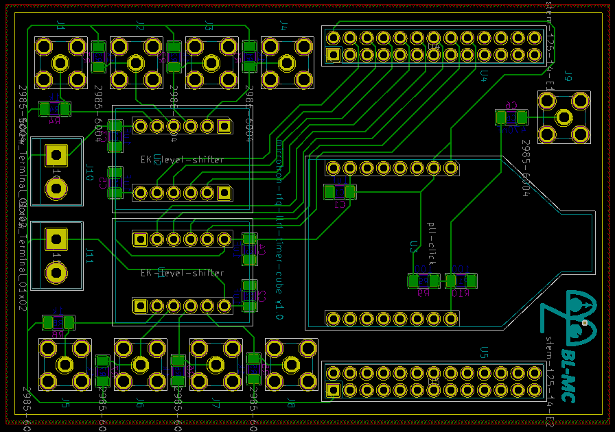

# RFQ LLRF Timer Cube
* <a href="https://github.com/bl-mirrotron/mirrotron-rfq-llrf-timer-cube" target="_blank">Source code</a>
* [RF frequency source](https://docs.bl-mirrotron.com/mirrotron-rf-src-tray/)
* [Gate generator](https://docs.bl-mirrotron.com/gateGen125-tray/)
* [Timing system overview](https://docs.bl-mirrotron.com/#timing-system)
* [Control system overview](https://docs.bl-mirrotron.com/)

The RFQ LLRF Timer Cube is a circuit card that mounts onto header connectors of a <a href="https://redpitaya.com/product-category/stemlab-125-14/" target="_blank">Red Pitaya Stemlab 125-14</a> computer  as shown in Figure 1.  The circuit is used both for the <a href="https://docs.bl-mirrotron.com/mirrotron-rf-src-tray/">RF Frequency Source</a> and the <a href="https://docs.bl-mirrotron.com/gateGen125-tray/">Gate Generator</a> for the <a href="https://docs.bl-mirrotron.com/#timing-system">Timing system</a>. The card contains two systems that can be used independently.

The first system connects a <a href="https://www.mikroe.com/pll-click" target="_blank">PLL Click</a> 8x Phase Lock Loop card that is used by the RF Frequency Source to multiply the 12.5 MHz Direct Digital Synthesizer signal from the Red Pitaya Stemlab 125-14 to 100 MHz.

The second system generates TTL level signals from the Red Pitaya Stemlab 125-14 FPGA digital output pin header to eight SMA RF connectors for the Gate Generator  used in the Timing system.

The circuit also provides 5V and 3.3V output from the Red Pitaya Stemlab 125-14 that can be used to power auxiliary devices such as micro-fans or low noise amplifiers.

The schematic for the card is shown in Figure 2 and the PCB layout is shown in Figure 3.

Figure 1.  RFQ LLRF Timer Cube mounted on a Red Pitaya Stemlab 125-14

 

Figure 2.  RFQ LLRF Timer Cube Schematic

 

Figure 3.  RFQ LLRF Timer Cube PCB layout

 
